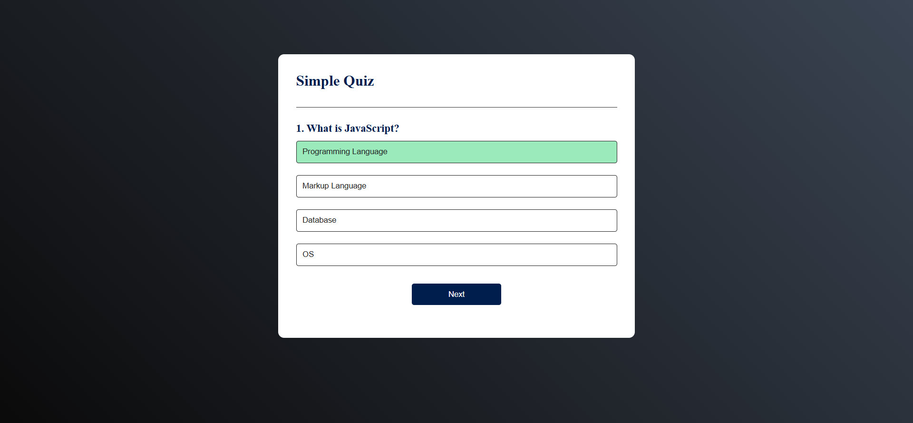
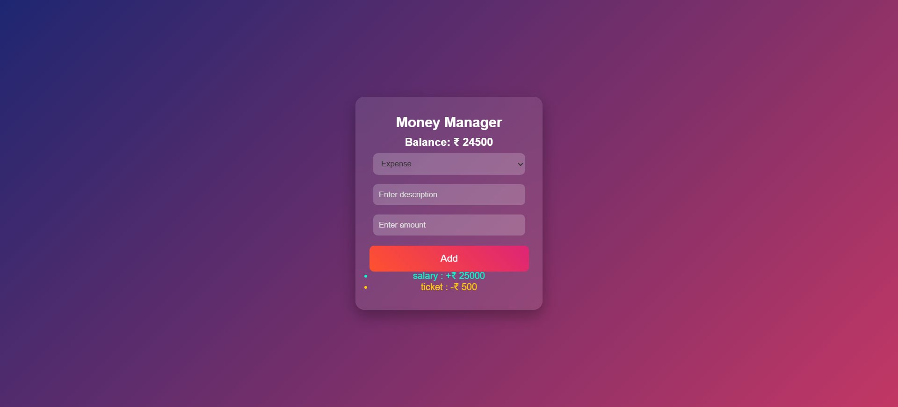
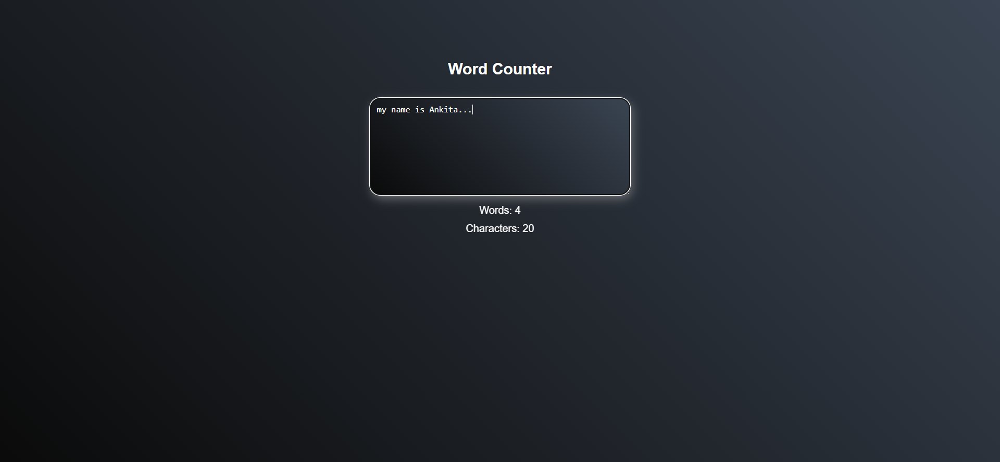
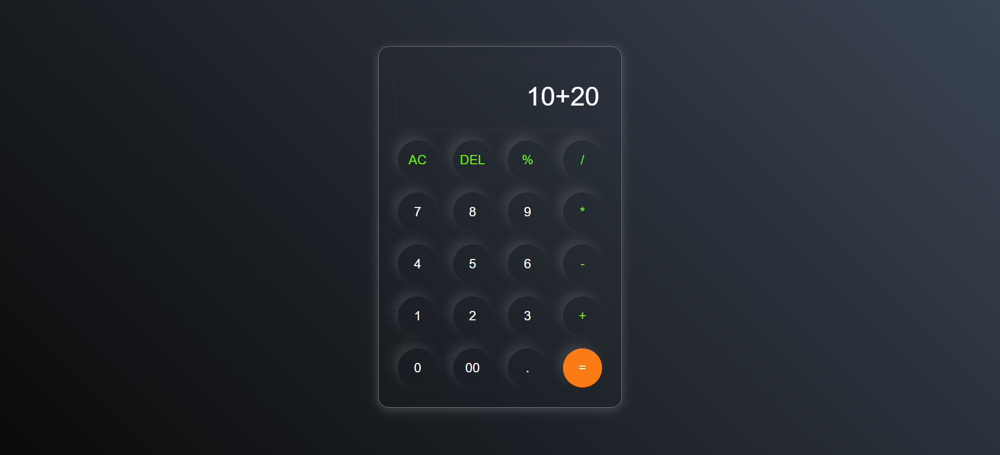
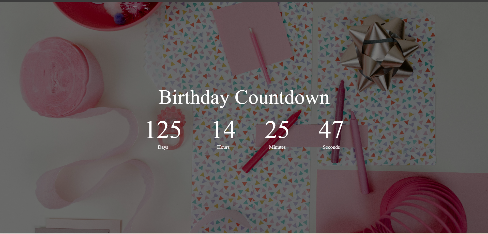

# 🚀 JavaScript Projects Collection

This repository contains beginner-friendly JavaScript projects 💻

---

## 🧠 Quiz App

  

* Multiple choice questions
* Score tracking
* Timer included

---

## 💰 Money Manager

  

* Add income & expense
* Balance calculation

---

## 📝 Word Counter

  

* Counts words & characters
* Live typing update

---

## 🧮 Calculator

  

* Basic operations
* Clear & delete

---

## 🎂 Birthday Counter

  

* Countdown timer
* Age calculation

---

## 🛠️ Tech Stack

HTML • CSS • JavaScript
